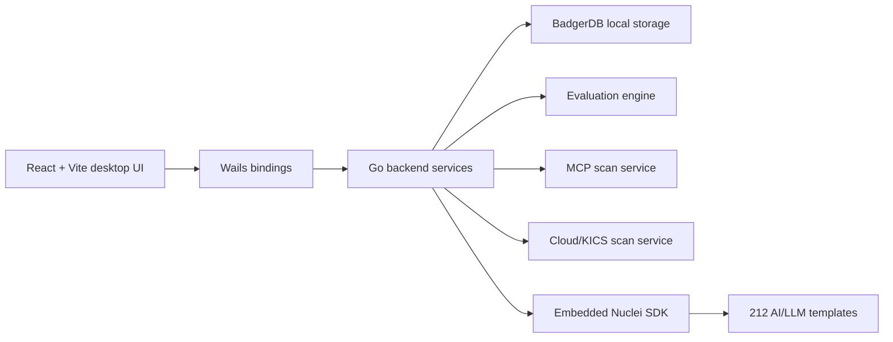

# Lack

<p align="center">
  <strong>AI/LLM security evaluation desktop client with embedded infrastructure vulnerability scanning.</strong>
</p>

<p align="center">
  <strong>English</strong> · <a href="./README.zh-CN.md">简体中文</a>
</p>

<p align="center">
  <a href="https://github.com/HOWMUCHSEC/lack/actions/workflows/ci.yml"></a>
  <a href="./LICENSE.md"></a>
  
  
  
  
  
  
  
  
</p>

> Lack is source-available software. It is licensed for noncommercial use under the PolyForm Noncommercial License 1.0.0. Commercial use requires separate written authorization from HOWMUCHSEC. See [License](#license).

## What Is Lack?

Lack is a desktop security workbench for AI application teams. It combines prompt/API evaluation workflows, MCP security testing, cloud infrastructure checks, and embedded AI/LLM infrastructure vulnerability scanning in a single Wails application.

The project is designed for teams that need to evaluate both model-facing behavior and the surrounding AI infrastructure: LLM gateways, vector databases, workflow tools, notebooks, dashboards, CI/CD systems, observability stacks, and common AI application frameworks.

## Core Capabilities

- **AI infrastructure vulnerability scanning**: runs a curated embedded Nuclei profile with 212 AI/LLM-related templates, plus a profile file at `nuclei-templates/profiles/ai-llm.yaml`.
- **Embedded-by-default templates**: release builds embed the retained template set into the binary, so the scanner does not depend on a full local `nuclei-templates` checkout.
- **Port discovery and target expansion**: identifies exposed HTTP(S) services and turns open ports into scan targets for the embedded Nuclei engine.
- **MCP security scanning**: provides MCP server/session scanning, realtime status, report details, and client setup support.
- **Cloud security checks**: integrates cloud/IaC-oriented scanning paths, including KICS-backed checks for supported workflows.
- **Prompt and API evaluation**: manages projects, targets, objectives, sample libraries, task execution, manual evaluation, and reports.
- **Local-first storage**: stores runtime data through the local backend storage layer, with optional cloud integrations configured explicitly by environment variables.
- **Desktop UX**: ships as a Wails app with React, Vite, TypeScript, Tailwind CSS, and localized Chinese/English interface text.

## Typical Use Cases

- Audit an AI app deployment for exposed Ollama, Open WebUI, Dify, Gradio, Jupyter, MLflow, Airflow, Ray, Spark, vector DB, dashboard, and CI/CD surfaces.
- Run AI/LLM infrastructure scans with a fixed embedded template set instead of broad generic web templates.
- Evaluate model/API responses against safety, jailbreak, and task-specific objectives.
- Inspect MCP server security behavior and archive scan reports.
- Generate local reports for engineering review before production exposure.

## Architecture



Key backend packages:

- `pkg/nucleiscan`: embedded Nuclei template handling, template selection, port scanning, scan execution.
- `pkg/cloudscan`: cloud/IaC scan repository and KICS integration.
- `pkg/scanner`: prompt/API scanning and evaluation request execution.
- `pkg/mcpserver`: local MCP scan server, middleware, and security checks.
- `pkg/storage`: local BadgerDB storage abstraction.
- `pkg/evaluator`: evaluator templates and manual evaluation flows.

## Tech Stack

| Area | Technology |
| --- | --- |
| Desktop shell | Wails v2 |
| Backend | Go |
| Frontend | React 19, TypeScript, Vite |
| UI/runtime | Tailwind CSS, Radix UI, Phosphor/Lucide icons |
| Storage | BadgerDB |
| Infrastructure scanning | ProjectDiscovery Nuclei SDK, curated embedded templates |
| Cloud/IaC scanning | Checkmarx KICS integration |
| Testing | Go test, Vitest, ESLint, TypeScript build |

## Requirements

- Go version from `go.mod`.
- Node.js `>=22.0.0`.
- pnpm `11.3.0`.
- Wails CLI for desktop builds.
- macOS build tools for `.app`/`.dmg` targets, or a Windows-capable environment for Windows builds.

Install Wails if needed:

```sh
go install github.com/wailsapp/wails/v2/cmd/wails@latest
```

Enable the pinned pnpm version:

```sh
corepack enable
corepack prepare pnpm@11.3.0 --activate
```

## Quick Start

Install frontend dependencies:

```sh
cd frontend
pnpm install --frozen-lockfile
cd ..
```

Run verification:

```sh
make verify
```

Run the frontend development server only:

```sh
cd frontend
pnpm dev
```

Run a Wails development session:

```sh
wails dev
```

## Build

Build the default release set:

```sh
make all
```

Build macOS universal DMG:

```sh
make mac-universal
```

Build Windows AMD64 executable:

```sh
make windows
```

For local dirty-tree builds, explicitly opt in:

```sh
make ALLOW_DIRTY=1 mac-universal
```

Build artifacts are written under `build/bin/` and are intentionally ignored by Git.

## AI/LLM Nuclei Template Profile

Lack retains a focused AI/LLM template set instead of shipping the full upstream Nuclei template repository.

- Scan templates: `212`
- Profile file: `nuclei-templates/profiles/ai-llm.yaml`
- Runtime default: fixed AI/LLM profile
- Generic web template scanning: not enabled by default

The default infrastructure scan path uses the embedded profile and refuses to silently fall back to scanning every available template. External template directories are only allowed when explicitly opted in for development or controlled testing.

Relevant environment variables:

| Variable | Purpose |
| --- | --- |
| `LACK_NUCLEI_TEMPLATES_DIR` | Optional external template directory override. |
| `LACK_NUCLEI_ALLOW_EXTERNAL_TEMPLATES=1` | Required before external template directories are accepted. |

## Environment Variables

Lack avoids hardcoded production cloud credentials. Optional integrations are configured explicitly through environment variables.

| Variable | Used by | Description |
| --- | --- | --- |
| `SUPABASE_URL` | backend evaluator | Optional Supabase project URL. |
| `SUPABASE_ANON_KEY` | backend evaluator | Optional Supabase anon key. |
| `VITE_SUPABASE_URL` | frontend | Optional frontend Supabase URL. |
| `VITE_SUPABASE_ANON_KEY` | frontend | Optional frontend Supabase anon key. |
| `SENTRY_DSN` | backend | Optional backend Sentry DSN. Empty disables backend Sentry. |
| `VITE_SENTRY_DSN` | frontend | Optional frontend Sentry DSN. Empty disables frontend Sentry. |

Local development `.env` files are ignored by Git. Commit only safe `.env.example` files.

## Security And Responsible Use

Use Lack only against systems you own or are explicitly authorized to test. The infrastructure scanner can send HTTP requests and vulnerability probes to targets derived from host/port discovery.

If you discover a vulnerability in Lack itself, please follow [SECURITY.md](./SECURITY.md).

## Documentation

- [Contributing](./CONTRIBUTING.md)
- [Security Policy](./SECURITY.md)
- [Third-Party Notices](./THIRD_PARTY_NOTICES.md)

## License

This repository is licensed under the [PolyForm Noncommercial License 1.0.0](./LICENSE.md).

Commercial use requires separate written authorization from HOWMUCHSEC. Commercial use includes offering Lack as a paid or hosted service, using it to provide customer-facing security services, integrating it into a paid product or commercial platform, or commercially distributing derivative works.

Third-party components and embedded templates may have their own licenses. See [THIRD_PARTY_NOTICES.md](./THIRD_PARTY_NOTICES.md) and [nuclei-templates/LICENSE.md](./nuclei-templates/LICENSE.md) for additional notices.
