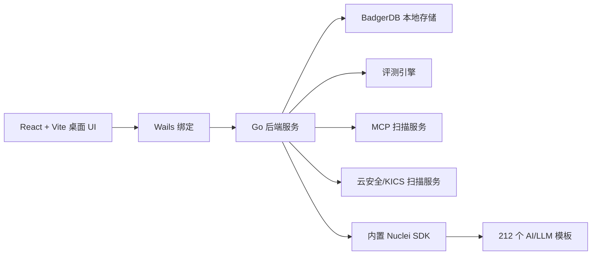

# Lack

<p align="center">
  <strong>面向 AI/LLM 安全评测的桌面客户端，内置基础设施漏洞扫描能力。</strong>
</p>

<p align="center">
  <a href="./README.md">English</a> · <strong>简体中文</strong>
</p>

<p align="center">
  <a href="https://github.com/HOWMUCHSEC/lack/actions/workflows/ci.yml"></a>
  <a href="./LICENSE.md"></a>
  
  
  
  
  
  
  
  
</p>

> Lack 是 source-available 软件。项目在 PolyForm Noncommercial License 1.0.0 下允许非商业使用。任何商业使用都必须先获得 HOWMUCHSEC 的单独书面授权。详见 [许可证](#许可证)。

## Lack 是什么？

Lack 是一个面向 AI 应用团队的桌面安全工作台。它把 Prompt/API 评测流程、MCP 安全测试、云基础设施检查，以及内置的 AI/LLM 基础设施漏洞扫描整合在一个 Wails 桌面应用中。

这个项目适合需要同时评估模型行为与 AI 周边基础设施的团队，例如 LLM 网关、向量数据库、工作流工具、Notebook、管理面板、CI/CD 系统、可观测性组件以及常见 AI 应用框架。

## 核心能力

- **AI 基础设施漏洞扫描**：运行经过筛选的内置 Nuclei profile，包含 212 个 AI/LLM 相关扫描模板，以及 `nuclei-templates/profiles/ai-llm.yaml` profile 文件。
- **模板默认嵌入构建产物**：发行构建会把保留的模板集嵌入二进制包，扫描器不依赖完整的本地 `nuclei-templates` 仓库。
- **端口发现与目标扩展**：识别暴露的 HTTP(S) 服务，并把开放端口转换成 Nuclei 扫描目标。
- **MCP 安全扫描**：支持 MCP server/session 扫描、实时状态、报告详情和客户端配置引导。
- **云安全检查**：集成云/IaC 方向的扫描流程，包括已支持工作流中的 KICS 检查。
- **Prompt 与 API 评测**：管理项目、目标、评测目标、样本库、任务执行、手动评测和报告。
- **本地优先存储**：通过后端本地存储层保存运行数据；可选云端集成必须通过环境变量显式配置。
- **桌面体验**：基于 Wails、React、Vite、TypeScript 和 Tailwind CSS 构建，并支持中英文界面文案。

## 典型场景

- 审计 AI 应用部署中暴露的 Ollama、Open WebUI、Dify、Gradio、Jupyter、MLflow、Airflow、Ray、Spark、向量数据库、管理面板和 CI/CD 入口。
- 使用固定内置的 AI/LLM 模板集进行基础设施扫描，而不是运行宽泛的通用 Web 模板。
- 针对安全、越狱和任务相关目标评估模型/API 响应。
- 检查 MCP server 的安全行为并归档扫描报告。
- 在生产暴露前为工程团队生成本地安全评估报告。

## 架构



关键后端包：

- `pkg/nucleiscan`：内置 Nuclei 模板处理、模板选择、端口扫描和扫描执行。
- `pkg/cloudscan`：云/IaC 扫描仓库与 KICS 集成。
- `pkg/scanner`：Prompt/API 扫描和评测请求执行。
- `pkg/mcpserver`：本地 MCP 扫描服务、中间件和安全检查。
- `pkg/storage`：本地 BadgerDB 存储抽象。
- `pkg/evaluator`：评测模板和手动评测流程。

## 技术栈

| 模块 | 技术 |
| --- | --- |
| 桌面壳 | Wails v2 |
| 后端 | Go |
| 前端 | React 19、TypeScript、Vite |
| UI/运行时 | Tailwind CSS、Radix UI、Phosphor/Lucide icons |
| 存储 | BadgerDB |
| 基础设施扫描 | ProjectDiscovery Nuclei SDK、精选内置模板 |
| 云/IaC 扫描 | Checkmarx KICS 集成 |
| 测试 | Go test、Vitest、ESLint、TypeScript build |

## 环境要求

- Go 版本以 `go.mod` 为准。
- Node.js `>=22.0.0`。
- pnpm `11.3.0`。
- 桌面构建需要 Wails CLI。
- macOS `.app`/`.dmg` 构建需要 macOS 构建工具；Windows 构建需要可用的 Windows 构建环境。

如需安装 Wails：

```sh
go install github.com/wailsapp/wails/v2/cmd/wails@latest
```

启用固定版本 pnpm：

```sh
corepack enable
corepack prepare pnpm@11.3.0 --activate
```

## 快速开始

安装前端依赖：

```sh
cd frontend
pnpm install --frozen-lockfile
cd ..
```

运行完整校验：

```sh
make verify
```

仅运行前端开发服务器：

```sh
cd frontend
pnpm dev
```

运行 Wails 开发会话：

```sh
wails dev
```

## 构建

构建默认发行产物：

```sh
make all
```

构建 macOS universal DMG：

```sh
make mac-universal
```

构建 Windows AMD64 可执行文件：

```sh
make windows
```

如果需要在本地脏工作区构建，必须显式开启：

```sh
make ALLOW_DIRTY=1 mac-universal
```

构建产物会输出到 `build/bin/`，并且不会进入 Git。

## AI/LLM Nuclei 模板集

Lack 只保留聚焦 AI/LLM 场景的模板集，而不是打包完整上游 Nuclei 模板仓库。

- 扫描模板：`212`
- Profile 文件：`nuclei-templates/profiles/ai-llm.yaml`
- 默认运行：固定 AI/LLM profile
- 通用 Web 模板扫描：默认不启用

默认基础设施扫描路径使用内置 profile，并且不会静默退回到“扫描所有可用模板”。外部模板目录只允许在开发或受控测试场景下显式开启。

相关环境变量：

| 变量 | 作用 |
| --- | --- |
| `LACK_NUCLEI_TEMPLATES_DIR` | 可选的外部模板目录覆盖。 |
| `LACK_NUCLEI_ALLOW_EXTERNAL_TEMPLATES=1` | 使用外部模板目录前必须显式开启。 |

## 环境变量

Lack 避免硬编码生产云服务凭据。可选集成必须通过环境变量显式配置。

| 变量 | 使用方 | 说明 |
| --- | --- | --- |
| `SUPABASE_URL` | 后端评测器 | 可选 Supabase 项目 URL。 |
| `SUPABASE_ANON_KEY` | 后端评测器 | 可选 Supabase anon key。 |
| `VITE_SUPABASE_URL` | 前端 | 可选前端 Supabase URL。 |
| `VITE_SUPABASE_ANON_KEY` | 前端 | 可选前端 Supabase anon key。 |
| `SENTRY_DSN` | 后端 | 可选后端 Sentry DSN。为空时禁用后端 Sentry。 |
| `VITE_SENTRY_DSN` | 前端 | 可选前端 Sentry DSN。为空时禁用前端 Sentry。 |

本地开发 `.env` 文件会被 Git 忽略。只提交安全的 `.env.example` 示例文件。

## 安全与授权使用

请只对你拥有或明确获得授权的系统使用 Lack。基础设施扫描器会向从主机/端口发现中派生出的目标发送 HTTP 请求和漏洞探测请求。

如果你发现 Lack 本身的安全问题，请按照 [SECURITY.md](./SECURITY.md) 处理。

## 文档

- [贡献指南](./CONTRIBUTING.md)
- [安全策略](./SECURITY.md)
- [第三方声明](./THIRD_PARTY_NOTICES.md)

## 许可证

本仓库使用 [PolyForm Noncommercial License 1.0.0](./LICENSE.md)。

商业使用必须获得 HOWMUCHSEC 的单独书面授权。商业使用包括但不限于：把 Lack 作为付费或托管服务提供、用于面向客户的安全服务、集成到付费产品或商业平台、或者商业分发派生作品。

第三方组件和内置模板可能拥有各自的许可证。更多信息请查看 [THIRD_PARTY_NOTICES.md](./THIRD_PARTY_NOTICES.md) 和 [nuclei-templates/LICENSE.md](./nuclei-templates/LICENSE.md)。
